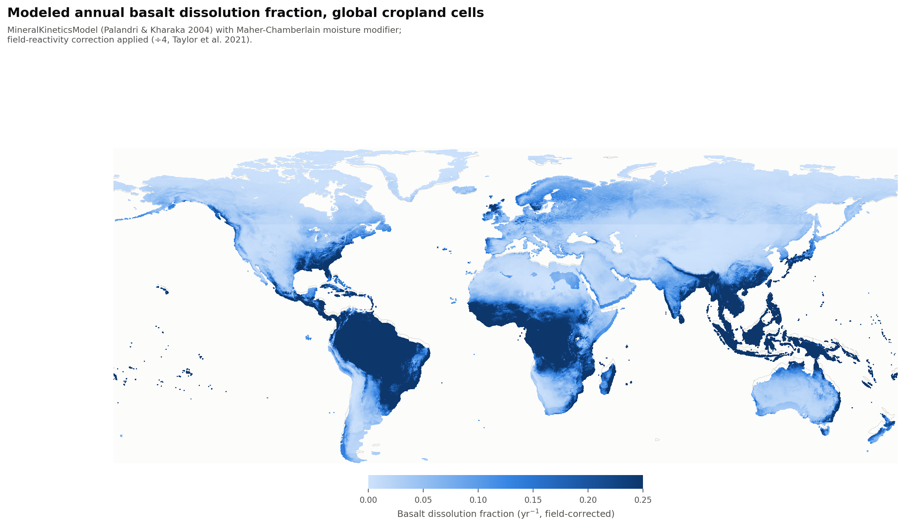

# ERW Core Weathering Model — Methodology, Status, and Open Questions

*This document walks through the core
weathering/CDR component of a global, pixel-level ERW techno-potential model
(the full model also has a TEA/LCA/transport layer and an agronomic co-benefits
layer, summarized briefly at the end). Everything below reflects the code as it
currently exists in the repo. NOTE: this section was mainly worked in May 2026 with some light 
updates this week (mid-Aug), but I'd say it's  the least recently updated part of 
the overall model. Perfect time for a revisit.*

FIGURES: I've added some figures to the repo. Note that there is still a bug visible at
50 degrees of latitute (data coarseness). Overall these figures are meant to catch these bugs
and show the differences between different model runs. In real life, they will be clipped to existing 
cropland (real deployment possibility), but are not clipped now to show the extent of spatial 
variation in weathering potential.

## Why this model exists

The model asks: *what if we knew the cost per tonne of ERW-based CDR everywhere,
and how do we bring those costs down?* A working theory is that some ERW
modeling pursues a level of geochemical specificity that isn't needed, given
how large the techno-economic and upstream-emissions
uncertainties already are — so this model prioritizes global coverage and an
honest uncertainty accounting over site-specific precision, on the bet that
knowing *where and why* prices can fall matters more for scaling the industry
than a marginally more precise estimate at any one site.

The core weathering model computes, for every cropland pixel globally, a
**maximum realized CDR rate** by starting from a theoretical ceiling and
multiplying down by a chain of independent physical bottlenecks:

```
CDR_max  (stoichiometric ceiling, tCO2/t rock)
  × dissolution_fraction    ← Does the rock actually dissolve this year?
  × CCE                     ← Did dissolution produce stable bicarbonate?
  × leaching_efficiency     ← Did that bicarbonate physically leave the soil?
  × (1 − system_loss)       ← What survived the river → ocean journey?
= realized CDR  (tCO2/ha/yr)
```

Each factor is kept separate on purpose: it means a low-scoring pixel can be
diagnosed ("this is a kinetics problem" vs. "this is a hydrology problem") rather
than just flagged as low.

One caveat on this formula, checked directly against the live code: of the
four multiplicative terms above, only **dissolution_fraction** and
**system_loss** are actually applied in the routing/allocation pipeline that
produces every reported CDR/cost figure. CCE and leaching_efficiency are
fully built, cited, and sensitivity-tested, but not currently wired into any
live (overall model) result (§2.4 and §3 explain what that means and why). The live formula
also includes a multi-year deployment-horizon averaging term not shown above,
left out here for simplicity.

## What feeds this model, at a glance

Before going stage-by-stage through CDR_max × dissolution_fraction × CCE ×
leaching_efficiency × (1 − system_loss), it's worth laying out what data
actually goes into it — this document covers a lot of ground and it's easy
to lose track of which input drives which term.

Three central spatial rasters drive the physical/kinetic side of the model:

- **Temperature** — drives the Arrhenius dependence in the Palandri rate law (§2.1)
- **Soil pH** — drives both the rate law's acid/base mechanisms and CCE's re-precipitation risk (§2.1, §2.4)
- **Precipitation-derived moisture variables** — storm frequency and storm depth feed the moisture modifier (§2.3); monthly precipitation and evapotranspiration separately feed leaching efficiency (§3)

Rock composition comes from a different source and works differently. Since
this is a simple weathering-kinetics model (not actually matching feedstock to
farm yet — that's the routing/allocation layer described in the Appendix), we
use lithology-level average compositions from EarthChem, restricted to the
rock types Hartmann et al. classify as volcanic and some plutonic — the
lithologies that actually make sense as ERW feedstock, not the full global
rock record. The EarthChem data is spatially kriged, and for the purposes of
this model alone, we take the *average* kind of rock you'd see in real
feedstocks and model potential per-ha CDR using that rock's mineralogy. That
average composition feeds the stoichiometric ceiling (§1) and the
composition-weighted kinetics blend (§2.2b).


---

## 1. Stoichiometric ceiling

The starting point is the theoretical maximum: if a tonne of rock dissolved
*completely*, how much CO₂ could it consume, via the bicarbonate pathway (2 mol
CO₂ per mol divalent cation, or 4 per mol forsterite)? For example (though real minerals from real feedstocks are used in the model):

| Mineral | tCO₂ / t rock | Basis |
|---|---|---|
| Basalt | 0.40 | Composition-weighted OIB/MORB average (MgO ~8%, CaO ~11%), rounded up from 0.35 to reflect Ca/Mg-rich reactive phases (pyroxene, olivine) |
| Olivine (Fo90) | 1.07 | 3.6 mol CO₂/mol × 44 / 147 g/mol |
| Wollastonite | 0.76 | CaSiO₃: 2 × 44 / 116.16 |
| Enstatite | 0.88 | MgSiO₃: 2 × 44 / 100.39 |
| Diopside | 0.82 | CaMgSi₂O₆: 4 × 44 / 216.66 |

One fix worth noting for comparability: an earlier version of this model
applied an additional ×0.5 "atmospheric fraction" discount here. That got
removed because it was double-counting the ocean Revelle-buffer term, which
is already applied once, correctly, downstream in system loss (§4). If you're
comparing against an earlier version of this model, or another model with a
similar discount at this stage, check it isn't being counted twice.

How this fits into the overall model: previously, the number 0.40 was a flat
mineral-level scalar used only by this core kinetics module in isolation. The
routing and cost-allocation pipeline that actually produces every reported
CDR/cost figure does **not** use it — it computes a real per-pixel ceiling from
actual kriged Ca/Mg chemistry per source cell (`CDR_pot_pixel = (2.195 ×
Ca_ppm + 3.620 × Mg_ppm) × 1e-6`, the same formula, already implemented and
live in `weathering/modules/cdr.py` / `scripts/run_build_headstart.py`, fed by
30 arc-sec kriged rasters). **All reported $/tCO₂ and CDR figures already reflect
real per-pixel rock composition, not one number for all basalt everywhere —
but current headline results do not yet reflect the molar composition-weighted
kinetics blend described in §2.2b, since that fix was only just implemented
and hasn't been propagated to the routing pipeline yet.**

The flat scalar's real footprint is narrower than this module's isolated use:
it also feeds `particle_tradeoff.py` (the grinding/particle-size-fineness
optimizer), which is live and currently disconnected from the same per-pixel
chemistry the routing side already has. That's an inconsistency
worth fixing (feed it the same `cdr_ceiling` values rather than duplicating
the formula with a stale constant) — but it only affects the optimal-grind-size
recommendation, not any cost or CDR figure reported to date, so is pretty much moot.

---

## 2. Dissolution fraction — the kinetics penalty

This part of the model is critical and also has no "right answer." It's
been discussed in depth in my lab, with particular advising from Ken Caldeira.

### 2.1 Rate law: Palandri & Kharaka (2004), not a shrinking-core model

The model computes dissolution rate as the sum of three pH-dependent Palandri &
Kharaka mechanisms (acid / neutral / base), each with its own Arrhenius
temperature dependence:

```
rate [mol/m²/s] = k_acid·[H+]^n·exp(-Ea_acid/RT)
                + k_neutral·exp(-Ea_neutral/RT)
                + k_base·[OH-]^n·exp(-Ea_base/RT)
```

This class is implemented as `MineralKineticsModel` — and its docstring is
explicit about a naming decision worth surfacing directly: **it was previously
called `ShrinkingCoreModel` and was renamed**, because it does not actually
implement the textbook Shrinking Core Model (chemE). There is
no time-evolving particle radius and no diffusion through a product layer in
this model — that machinery describes *mechanical* weathering (grinding,
attrition), where the reacting surface genuinely shrinks and changes shape over
time (Steve Davis feedback). ERW basalt/olivine dissolution is *chemical* weathering: a fixed BET
surface area reacting via the Palandri rate laws above.  We kept the option to revisit
**time-evolving surface area** as reacted rock's exposed surface changes shape
(tracked as an open issue, not implemented) — but that's a distinct, smaller
question from "should this be a mechanical shrinking-core model," which we
answered no to.

### 2.2 Reactive surface area: BET, not fractal roughness

An earlier version scaled surface area from particle diameter using a fractal
roughness formula (Beerling et al. 2020 Eq. 8, `λ = (r/a)^d`). The problem: the
fractal exponent *d* spans 0.20–0.45 in Beerling's own stated uncertainty range,
and that translates into a **26× CDR spread at 100 µm** — the model was hinging
on an essentially unmeasured exponent, which isn't defensible for a headline
number.

We switched to literature-measured **BET (Brunauer–Emmett–Teller) specific
surface area** — a standard characterization technique (gas adsorption) that
directly measures reactive surface area including grinding-induced
microcracking, rather than inferring it from a shape-roughness proxy. This
collapses the uncertainty to **~6×** (the actual measured range across ERW
field-trial materials), and lets us scale BET with particle size via an
empirical power law (exponent 0.70, from Amann et al. 2022 olivine data)
instead of an assumed geometric one.

| Mineral | Central BET SSA (m²/g) | Measured range | Key sources |
|---|---|---|---|
| Basalt | 7.5 | 2.5–15 | Vienne 2022, Kelland 2021, Kantzas 2022 |
| Olivine/dunite | 5.0 | 2.0–15 | Amann 2022 |
| Wollastonite | 4.0 | 1.5–20 | Front. Plant Sci. 2022, Haque et al. |
| Enstatite / Diopside | 6.0 | 2.5–12 | No direct ERW measurement — proxied from pyroxene/basalt |

If you have a BET measurement for an actual feedstock, the model accepts it
directly as an override — that's the intended operational use, not just a
global default. NOTE: this ends up actually mattering very little in the model

### 2.2b Composition-weighted kinetics... fixed, (but needs to be fully implemented)

A gap surfaced while prepping this document: the
stoichiometric ceiling (§1) has always used each source's real per-pixel
Ca/Mg composition, but the dissolution *kinetics* (i.e. which rate constants
actually govern how fast that ceiling gets realized) didnt. Every real
basalt source used identical labradorite (basalt-proxy) rate constants
regardless of its own measured chemistry; only one hand-named point source
(Norway) ever got olivine kinetics, and that was an identity label, not a
composition threshold.

**Fixed:** `MineralKineticsModel` now supports a molar-Ca/Mg-weighted blend
between labradorite (basalt-proxy) and forsterite (olivine-proxy) kinetics,
in place of picking one categorically:

w_Mg = mol_Mg / (mol_Ca + mol_Mg)
blended_rate = w_Mg × rate_forsterite + (1 − w_Mg) × rate_labradorite

Blended on a **molar** basis (not mass). Palandri rates are inherently molar
(mol/m²/s), so weighting by mass fraction would answer a different question
("how much of this rock's mass is olivine-like") than the one that matters
here.

**Why we stopped w/ two endmembers.** A third (diopside, CaMgSi₂O₆, which
carries Ca and Mg together) is mathematically identifiable from bulk Ca+Mg
alone, but not always physically valid — it can solve to a negative phase
fraction for some real compositions and would need a validity-guarded
fallback. A fourth is not identifiable from Ca+Mg alone at all, regardless of
guarding (more unknowns than equations). Going further would need another
independent elemental constraint e.g. aluminum is a structurally clean
candidate, since it's essentially exclusive to feldspar among these minerals
and almost certainly already sits in our EarthChem samples, unused. We're
holding off on that for two reasons: it needs validation against real
per-sample data before it can be trusted (illustrative compositions broke
even the better-conditioned aluminum version), and EarthChem's
literature-compiled sampling is biased toward whatever happened to get
published, so a finer decomposition amplifies that bias rather than diluting
it. **This is a documented, deferred possibility** —
if dissolution-rate resolution beyond this 2-phase blend is ever needed, this
is where to pick it back up, with real per-sample major-oxide data.

**Status:** this fixes the standalone kinetics module and the live
grinding/particle-size optimizer (`particle_tradeoff.py`) — both verified
against edge cases (pure-Ca composition reproduces basalt exactly, pure-Mg
reproduces olivine exactly) and backward-compatible with existing callers.
It does **not YET** reach the production routing/allocation pipeline, which
still selects kinetics via a hardcoded per-source identity flag rather than
real composition. Propagating the fix there requires re-scoring the full
candidate set on the HPC Sherlock and has not been run yet. Treat current 
headline CDR/cost figures as reflecting the pre-fix kinetics until that 
rerun happens --> this is a planned step.

### 2.3 The moisture modifier =  BIGGEST current uncertainty

This is the piece I most want a second opinion on. Silicate dissolution in ERW
is **transport-limited**: porewater reaches local equilibrium with the mineral
surface in seconds, so what actually controls long-run dissolution is *how
often fresh water flushes that porewater* and keeps it far from equilibrium —
not the reaction rate itself. That means both the **frequency** of rain events
and their **intensity/depth** matter, and getting this term right is the
single biggest open modeling question here.

**What's live now:** the Maher & Chamberlain (2014) porewater-flushing
framework. Flushing flux is approximated as `λ × α` (storm frequency ×
mean storm depth ≈ mean daily precipitation), fed through a saturating
Michaelis-Menten form:

```
W(λ, α) = clip[ (λα) / (λα + K),  0.01, 1 ]
```

`K` (half-saturation flushing flux) is treated as a Monte Carlo parameter:
lognormal, median 1.2 mm/day (P5 ≈ 0.5, P95 ≈ 3.0).

**A data-resolution issue in λ/α, actively being replaced.** CHIRPS (the
precipitation source behind λ/α) only covers 50°S–50°N; above that, the model
falls back to CRU TS, which is 10× coarser (0.5° vs. CHIRPS' native 0.05°).
The values above 50° are real and climatologically valid, but visibly
blockier — a texture change, not a bias, right at the 50° line, and it's
noticeable in the actual output maps we're looking at right now. We're
replacing CRU TS with ERA5-Land (via the Copernicus Climate Data Store,
~0.1° native resolution,  global) to close this gap; that download
and reprocessing is in progress as of this writing.

**What this replaced:** the model previously used `wet_fraction = λ/(λ+δ)`
(Calabrese & Porporato 2020) — storm *frequency* only. That formulation scored
frequent drizzle the same as rare heavy downpours, even though a 1 mm event
doesn't flush porewater the way a 20 mm event does. Switching to `λ×α` was the
fix for exactly that blind spot, and it's already deployed.

**The path we didn't take, and might still be worth taking:** the full
Calabrese & Porporato stochastic soil-moisture framework, which treats soil
moisture itself as a stochastic process (a function of storm arrival rate,
storm depth, soil water storage capacity, ET demand, and drainage recession)
and derives the exact steady-state wet fraction from the resulting probability
density — rather than a single saturating curve. This is more physically
complete (it naturally handles cases like a small storm on sandy vs. clay soil
draining differently) and sets up a natural extension where drainage recession
varies by soil texture. We didn't build it because it needs 2–3 new input
rasters and meaningfully more code, and the simpler `λ×α` form already fixed
the specific blind spot that motivated the change. **This is a real fork we
could still take** if there's a strong view that the extra physical fidelity is 
worth the preprocessing lift.

OVERALL I find this component the most vexxing and worth discussion — would love Cascade's take on this one specifically.

### 2.4 Carbon capture efficiency (CCE) — built, not currently wired in

Of the alkalinity dissolution produces, what fraction becomes *stable*
bicarbonate rather than immediately re-precipitating? Dietzen & Rosing (2024):
a logistic function of soil pH with a sweet spot around pH 5.5–7, falling to
near-zero below pH 4.5 (dissolution itself is suppressed) and above pH ~7.8
(re-precipitation risk in calcareous soils), modulated slightly by soil pCO₂.

Checked directly against the code, not assumed: this function is fully built
and correctly implemented, but it is not applied anywhere in the live
pipeline. Every reported CDR/cost figure implicitly treats CCE as if it were
1.0 everywhere, with no pH dependence.

Why it's been left out for now: the still-open reason to be deliberate about
how (or whether) to wire it back in is that CCE's falling limb (re-precipitation
risk above pH 7.8) and leaching efficiency both penalize the same dry,
calcareous soils — once for chemistry, once for hydrology — and separately,
strong-acid neutralization (already applied, in system loss, §4) and CCE at
low pH may overlap in heavily fertilized acidic soils. Turning CCE on without
resolving whether either of those is double-counting an existing penalty risks
trading one known gap for a harder-to-detect one. Beerling (2020) also doesn't
apply CCE, though that's a weaker precedent than it sounds — Dietzen & Rosing's
CCE formulation postdates Beerling's paper by four years, so it wasn't a choice
Beerling could have made either way.

---

## 3. Leaching efficiency — did the alkalinity actually leave the soil? Built, not currently wired in

Of the CDR-eligible alkalinity produced, what fraction physically left the soil
and reached a river, rather than being retained in the root zone?

The intended formula is:
`leff = max(0, (P − ET) / P)` — net water surplus, on the logic that plants
transpire water but leave dissolved ions behind, so it's the *surplus* that
drives subsurface drainage, not gross runoff (we deliberately did not use
runoff/precip — runoff doesn't necessarily mean the water actually contacted
and leached alkalinity from the weathering zone). But `dissolution_fraction()`'s
`leaching_eff` parameter **defaults to 1.0 (no penalty) when not supplied, and
nothing in the live pipeline ever supplies a real value** — same check as §2.4,
same result: zero live call sites pass an actual `leaching_eff`. Every reported
CDR/cost figure currently assumes 100% of dissolved alkalinity leaves the soil,
full stop.

Leaching efficiency is, by a wide margin, the single most sensitive parameter
this model has ever measured (see §5's caveat on that number's own vintage) —
global cropland median `leff ≈ 0.26`, which would suppress the central CDR
estimate roughly 4× relative to the `leff = 1` convention the live pipeline is
currently running under by omission. Beerling (2020) and Kantzas (2022) also
use `leff = 1` everywhere, so the live pipeline's current behavior happens to
match their convention — but by accident, not by adopting it deliberately, and
theirs was a stated modeling choice while this one wasn't.

Why it's been left out: the legitimate reason to be careful about switching
it on now is that the moisture modifier (§2.3) and leaching efficiency
both decline in arid climates and would multiply together (e.g. 0.6 × 0.05 ≈ 3%
combined retention in a dry case) — compounding two genuinely distinct physical
processes (dissolution kinetics vs. mass transport), or double-penalizing one
underlying fact about a place being dry? And CCE's falling limb and low leaching
efficiency both hit the same dry, calcareous soils from different mechanisms
(§2.4). Wiring leaching efficiency in without resolving those interactions risks
overcorrecting in exactly the driest, most CDR-marginal places.

Update: the monthly-aggregation fix has now actually been run, not just
designed. `leff = Σ_months max(0, P_m − ET_m) / Σ_months P_m` instead of the
annual formula above, because the annual version badly under-credits climates
with a wet season and a dry season (a Mediterranean-type site nets out to a
small annual surplus even though most of the actual leaching happens in a few
wet months). We regenerated the full global raster (30-year monthly CHIRPS
precipitation × 30-year monthly TerraClimate ET climatology, both complete
1991–2020): global median leaching efficiency rises from **0.26 (annual) to
0.33 (monthly)**, confirming the annual formula really was under-crediting
broadly, not just in Mediterranean climates specifically. Comparison maps for
both versions exist. **But this still isn't wired into any live overall result** — the
spatial input layer for even the simpler annual formula was never read by
anything live, so this is a fix to a penalty that isn't currently applied at
all (see the top-of-document caveat and §7). And per the note below, wiring in
the monthly-fixed leaching efficiency *without* also revisiting the moisture
modifier's own temporal aggregation risks overstating how much this actually
fixes.

A comparison figure set exists to make this gap visible.
`figures/gross_cdr_v1_year1.png` through `v3b_10yr_cohort_leffMonthly.png`
(full writeup in `figures/gross_cdr_comparison_summary.md`) isolate leaching
efficiency's effect directly: the same gross-CDR map, same composition, same
everything else, computed with leaching efficiency off (the live pipeline's
implicit convention), then on (old annual formula), then on (corrected
monthly formula). This is a sensitivity demonstration, not a calibration
exercise — we're not checking these numbers against any independently
measured field-observed dissolution/CDR dataset, because we don't have one in
hand for this comparison. What it shows is the range of plausible headline
CDR numbers depending on whether this term is switched on: global mean drops
from 4.83 (off) to 1.74 tCO₂/ha/yr (on, monthly-corrected). That's the input
needed to decide whether and how to wire it in, rather than treating the live
pipeline's current default of `leff = 1` as a neutral or validated choice. No
equivalent figure exists yet for CCE — the comparison set above only varies
leaching efficiency; building CCE's standalone version would be a natural
next step if useful.

A second-order finding worth its own callout: the moisture modifier has the
*opposite* aggregation bias, still uncorrected. It (§2.3)
still uses *annual* λ/α, never upgraded to the same monthly treatment. Because
`W = λα/(λα+K)` is a saturating (nonlinear) function, averaging λα over the
year before applying it is not the same as applying it monthly and averaging
the result (Jensen's inequality) — and unlike leaching efficiency, this biases
the moisture modifier *upward* in seasonal climates, by an estimated 20–30%.
There's an existing worked Mediterranean example on record: annual-mean W =
0.65 vs. the correct monthly-averaged W = 0.47 — a ~28% reduction once fixed.
Combined with the leaching-efficiency fix in that same example, `W × leff`
moves from 0.05 (both annual) to 0.31 (leaching efficiency fixed, moisture
modifier still annual, uncorrected) — and would land somewhere *below* 0.31 if
the moisture modifier's own ~28% overcorrection were also removed. **In other
words: fixing leaching efficiency's aggregation alone, without also fixing the
moisture modifier's, doesn't close the gap — it corrects one side of what was,
by accident, a partially self-canceling pair of biases**, and the net effect
in exactly the seasonal climates where both matter most (Mediterranean,
monsoonal) is currently *overstated* until the moisture modifier gets the same
treatment. A scoped fix already exists (~60 lines, one new 12-band monthly λα
raster, same shape as the leaching-efficiency fix) — genuinely the single most
concrete thing left to resolve before either term's numbers should be treated
as final, and exactly the kind of thing worth discussing before deciding how
to proceed.

A further, not-yet-built refinement in the same spirit: treating `(P−ET)` as a
random variable across years rather than a single climatological value (CHIRPS
has 40+ years of daily data to support this), modeling the alkalinity pool as a
buffer that accumulates in dry years and flushes in wet ones. More physically
faithful to how a real deployment would actually behave; a substantially bigger
methodological lift, and explicitly not attempted yet.

---

## 4. System loss — what survives the river-to-ocean journey (live, but flat global percentages — not spatially varying)

Of the alkalinity that reached a river, what fraction survives all the way to
the ocean as *permanent* removal? Unlike §2.4 and §3, this term **is** applied
in the live pipeline — confirmed directly: `bin_candidates_by_cost.py` sets
`CDR_RETENTION = system_retention_factor()` and multiplies it directly into
every reported `gross_cdr_t_ha`. Four independent sub-penalties, combined
multiplicatively (not additively):

| Sub-component | Loss | Mechanism |
|---|---|---|
| Plant uptake | 1% | Ca/Mg assimilated by crops rather than exported |
| Strong-acid neutralization | 2% | Alkalinity consumed by fertilizer-derived HNO₃/H₂SO₄ in soil |
| River carbonate re-precipitation | 1% | Secondary CaCO₃/MgCO₃ formation in transit |
| Ocean equilibration (Revelle buffer) | 10.5% | Fraction of exported bicarbonate that re-outgasses at the ocean surface |
| **Total** | **≈14.2%** | `1 − Π(1 − loss_i)`; net retention ≈ **0.858** |

**Comparability note:** Beerling (2020) and Kantzas (2022) don't apply *any*
system-loss discount. That's a meaningful convention difference, not just a
parameter difference — worth reporting gross CDR (their convention) alongside
net CDR (this model's) rather than only the net number, so a reader can tell
which discount is driving an apparent discrepancy against those papers.

---

## 5. Sensitivity — which penalty actually drives the uncertainty

One-at-a-time sensitivity ranges on total CDR, holding everything else at its
central value:

| Parameter | CDR range (OAT) |
|---|---|
| Leaching efficiency | ±384% |
| Temperature (Arrhenius Eₐ) | ±251% |
| Soil pH (CCE + Palandri acid mechanism) | ±204% |
| BET surface area | ±167% |
| Storm frequency λ | ±51% |
| Soil drainage rate δ | ±21% |
| Soil pCO₂ | ±18% |

**Vintage caveat:** these numbers are historical —
the analysis script that produced them (now archived) explicitly documents
that it used the *old* frequency-only moisture modifier (`λ/(λ+δ)`, superseded
by §2.3's `λ×α` form) and the old annual-aggregated leaching efficiency, and
its own header calls these values out as "historical baselines, not current
values." They're reported in an internal advisor-review doc (not included in
this repo), not regenerated since. They're also sensitivities *around* a model configuration
that included CCE and leaching efficiency as active terms — which, per §2.4
and §3, the live pipeline currently doesn't. So today, leaching efficiency and
CCE's *actual* live sensitivity is zero (they're fixed at an implicit 1.0,
contributing no variance at all) — these percentages describe how much they'd
matter *if and when* they're wired back in, based on the last time this was
measured, not a live re-run. Leaching efficiency dominating by over 1.5× the
next-largest driver is almost certainly still directionally right — the
underlying physics didn't change, only the moisture-modifier form did — but a
fresh OAT/tornado run against the current live configuration, once CCE and
leaching efficiency are actually switched on, is worth doing before treating
these exact percentages as current.

---

## 6. Dissolution rate map — does the spatial pattern look right?

As a sanity check in the spirit of the ERW26 presentation, here's global
modeled annual basalt dissolution fraction (`dissolution_fraction` — per §2.4
and §3, this is currently the *last* multiplicative step actually applied
before system loss, since CCE and leaching efficiency aren't live yet — after
the lab-to-field correction noted below) across cropland cells:



*Built from `MineralKineticsModel` + the Maher-Chamberlain moisture modifier,
driven by CHELSA temperature, SoilGrids pH, and CHIRPS-derived storm
frequency/depth — 1,567,309 cropland cells. Note: above 50°N/50°S, storm
frequency/depth falls back to coarser CRU TS data (see §2.3) — real values,
but visibly blockier, and currently being replaced with ERA5-Land.*

Regional means, checked against what we'd physically expect (warm + wet →
faster transport-limited dissolution):

| Region | Mean dissolution fraction |
|---|---|
| Equatorial tropics (Amazon, Central Africa, SE Asia) | 0.220 |
| US Midwest (temperate) | 0.094 |
| N. Europe (cool, humid) | 0.065 |
| Australia (arid/semi-arid interior) | 0.064 |
| N. Africa / Sahel / Arabia (arid) | 0.047 |

The tropics come out roughly 4–5× higher than arid regions, which is the
direction and rough magnitude we'd expect from Arrhenius temperature scaling
compounding with the moisture-flushing term — both penalize the same arid
regions via different physical mechanisms, which is itself one of the open
double-counting questions in §7.

*(Note: `dissolution_fraction` here already includes a lab-to-field correction
of ÷4 (Taylor et al. 2021) — Palandri lab rates measured under ideal
far-from-equilibrium conditions overstate field rates 3–10× due to surface
passivation and partial wetting; ÷4 is our central estimate, with a Monte Carlo
range of 0.10–0.50.)*

---

## 7. Open questions where I'd want another set of eyes

These are live, unresolved, and exactly the kind of thing worth discussing
before treating any headline number as final.

Read this section with §2.4 and §3 in mind: these aren't questions about
terms currently fighting each other in a live calculation. CCE and leaching
efficiency aren't wired in yet, so nothing below is double-counting anything
today — they're the reason we've been deliberate about *how* to wire them
back in rather than just flipping them on. Resolving these is a prerequisite
for turning CCE/leaching efficiency on, not a critique of something already
running.

**Double-counting across penalties.** Several of the independent-seeming
bottlenecks above may not be as independent as the multiplicative structure
assumes:
- CCE's falling limb (re-precipitation risk above pH 7.8) and low leaching
  efficiency both penalize dry, calcareous soils — once for chemistry, once for
  hydrology. Genuinely distinct mechanisms, or the same underlying fact
  represented twice?
- The moisture modifier and leaching efficiency both decline in arid climates,
  and multiply together (e.g., 0.6 × 0.05 ≈ 3% combined retention in a dry
  case) — is that compounding two distinct physical processes (dissolution
  kinetics vs. mass transport), or double-penalizing one underlying fact about
  a place being dry? **Sharper version of this, now quantified (§3):** the two
  terms also disagree on temporal aggregation — leaching efficiency's monthly
  fix corrects a *downward* seasonal bias, while the moisture modifier's
  still-annual aggregation carries an *uncorrected upward* seasonal bias of
  similar size (~20–30%, Mediterranean/monsoonal climates worst-affected).
  These aren't the same question (independence-of-mechanisms vs.
  consistency-of-aggregation), but they compound: until the moisture modifier
  gets the same monthly treatment, the two errors partially — and
  uncontrollably — cancel, so neither term's number should be read as final in
  isolation.
- Strong-acid neutralization (system loss) and CCE at low pH may overlap in
  heavily fertilized acidic soils — one penalizes natural soil acidity, the
  other penalizes fertilizer-derived acid specifically, but they can be hard to
  disentangle empirically.

**Leaching efficiency isn't wired into the live pipeline at all (§3)** — the
biggest single gap in this document, given it's the model's most sensitive
parameter. The monthly-aggregated version has now been built and run (global
median 0.26 → 0.33), but per the note above, its numbers shouldn't be treated
as the corrected picture until the moisture modifier's matching aggregation
fix is also done — right now only one side of a two-sided bias has been
addressed.

**CCE isn't wired into the live pipeline at all (§2.4)** — same status, smaller
sensitivity, same open double-counting questions above standing in the way of
just turning it on.

**The moisture modifier's functional form (§2.3)** — `λ×α` saturating flux is
live and is a real improvement over the frequency-only predecessor, but the
full Calabrese-Porporato stochastic treatment remains a path not taken that
might be worth taking, especially since it would also let soil-texture-driven
drainage variation enter the model coherently.

**Time-evolving reactive surface area.** As rock weathers, its exposed surface
area changes shape — currently treated as fixed at the initial BET value for
the whole simulated period. Distinct from (and smaller than) the
mechanical-shrinking-core question already resolved in §2.1; still open.

**Per-pixel stoichiometric ceiling (§1)** — scoped with a specific formula and
the input data already in hand, just not wired in yet.

---

## Appendix: the rest of the model, briefly

For context, the weathering model above feeds two downstream layers not
detailed here:

- **TEA/LCA/transport** — converts realized CDR into $/tCO₂ and a full
  lifecycle emissions balance (7 stages: extraction, shipping, grinding,
  distribution, application, mineralization, system loss), with country-level
  cost/grid-emissions localization and a grinding-fineness ↔ reactive-surface-area
  trade-off (finer grind → more CDR but more grinding energy/cost, via Bond's
  Law). Routing optimizes feedstock source and mode (road/rail/inland
  water/maritime) against both cost and mineral quality jointly.
- **Agronomic co-benefits** — values avoided lime cost and crop yield increase
  (via the same pH mechanism ERW uses, plus Mg/Si nutrient effects lime doesn't
  provide), which materially changes where ERW is economically viable without a
  carbon price — preliminary results suggest ~40–55% of cropland in India,
  Kenya, and Brazil could be self-financing today on lime-replacement value
  alone.

Happy to produce an equivalent walkthrough for either of these on request.
